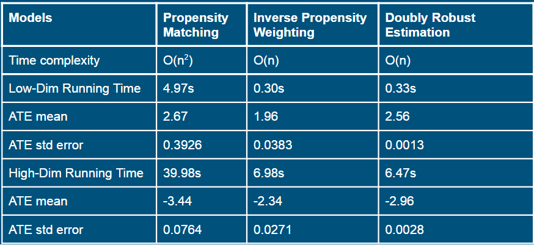

# GR5243 Fall 2020 Applied Data Science
# Project 4 Causal Inference Algorithms Evaluation

Firstly, we introduce the definition of causal effects. Suppose we have a random sample of size N from a large population. For each unit i in the random sample, we use $T_i\in\{0,1\}$ to denote whether the unit i received the treatment of interest. Let $Y_i(0)$ indicates the outcome that the unit i was under control while $Y_i(1)$ indicates the outcome under treatment. For unit i the treatment effect is $Y_i(1) - Y_i(0)$. We are interested in the average effect of the treatment in the whole population (to simply the notation, we suppress subscript i for unit):
$\Delta = E(Y_1 - Y_0) = E(Y_1) - E(Y_0)$

Our group calculate ATE using Propensity Matching, Inverse Propensity Weighting and Doubly Robust Estimation along with L2 penalized logistic propensity score estimations.

The statistics of the three algo implemented on low-Dim and high-Dim datasets follows:



To summarize our findings, Propensity Weighting is unstable and sensitive to thershold choosing, which in turn determine the total number of matching pairs. Also, it is the most time consuming algo.

Inverse Propensity Weighting is a better algorithm. With no need to compute the pair-wise distance, it runs fast, but may be biased.

Doubly Robust Estimation combines the predicted outcome from linear regression with propensity score to estimate the causal effect. Without combining, these two methods can be easily biased. Doubly Robust Estimation reduces the likelihood to be biased since only one of the 2 models need to be correctly specified to obtain unbiased estimator.

And from the results formula, Doubly Robust Estimation performs the best in our experiment. The predicted ATE is closer to true ATE and the standard error of ATE is smaller.


## Coding Part

## 1. Setup
```{r message=FALSE, warning=FALSE}
library(Matching)
library(glmnet)
library(tidyverse)
library(ggplot2)
setwd("./")
```


## 2. Load Data
```{r, warning=FALSE}
ldim <- read.csv("../data/lowDim_dataset.csv")
hdim <- read.csv("../data/highDim_dataset.csv")

# Low Dimention
ltr <- ldim$A
ly <- ldim$Y
lx <- ldim[,-c(1,2)]

# High Dimention
htr <- hdim$A
hy <- hdim$Y
hx <- hdim[, -c(1,2)]
```


## 3. Calculate Propensity Score with L2 Ridge regression for Propensity Matching

The logistic regression model represents the class-conditional probabilities through a linear function of the predictors:

$logit[Pr(T=1|X)]=\beta_0+\beta_1x_1+...+\beta_px_p$
$Pr(T=1|X)=\frac{1}{1+e^{-(\beta_0+\beta_1x_1+...+\beta_px_p)}}$

To avoid overfitting of the logistic regression model, we introduce regularization term to decrease the model variance in the loss function Q. In order to achieve this, we modifying the loss function with a penalty term which effectively shrinks the estimates of the coefficients. In this case, the penalty term is L2 norm:

$Q=-\frac{1}{n}\Sigma[y_i(\beta_0+\beta_1x_1+...+\beta_px_p)+log(1+exp(\beta_0+\beta_1x_1+...+\beta_px_p))]+\lambda\Sigma\beta_j^2$

```{r, warning=FALSE}
seed <- c(0,2,3,5)
start_time <- Sys.time()

p_score <- function(seednum){
  set.seed(seednum)
  glm1 <- cv.glmnet(as.matrix(lx), ltr, family = "binomial", alpha = 0)
  
  glm1.fit <- predict(glm1$glmnet.fit, 
                      s = glm1$lambda.min, 
                      newx = as.matrix(lx),
                      type = "response")
  
  set.seed(seednum)
  glm2 <- cv.glmnet(as.matrix(hx), htr, family = "binomial", alpha = 0)
  
  glm2.fit <- predict(glm2$glmnet.fit, 
                      s = glm2$lambda.min, 
                      newx = as.matrix(hx),
                      type = "response")
  
  return(list(l=glm1.fit,h=glm2.fit))

}

p_score_list <- lapply(seed,p_score)
```

## 4. Propensity Matching

The distance of Propensity Score is defined as:

$D_{ij} = |e_i - e_j|$

where $e_k$ is the propensity score for individual k

We set up thresholds for matching and make pairs for data point in different groups which have distance below the threshold. Thus as the threshold increases, more pairs are matched, and it will converge to all data matched when threshold comes to 100 percent.

### 4.1 Distance calculated
```{r, warning=FALSE}
dist_mat <- function(li){
  glm1.fit <- li$l
  glm2.fit <- li$h
  n1 <- length(glm1.fit)
  dt1 <- matrix(0,nrow = n1, ncol = n1) 
  for (i in 1:(n1-1)){
    dt1[i,i] <- 1
    for (j in (i+1):n1){
      dt1[i,j] <- abs(glm1.fit[i] - glm1.fit[j])
      dt1[j,i] <- dt1[i,j]
    }
  }
  
  
  
  n2 <- length(glm2.fit)
  dt2 <- matrix(0,nrow = n2, ncol = n2) 
  for (i in 1:(n2-1)){
    dt2[i,i] <- 1
    for (j in (i+1):n2){
      dt2[i,j] <- abs(glm2.fit[i] - glm2.fit[j])
      dt2[j,i] <- dt2[i,j]
    }
  }
  
  return(list(lm=dt1,hm=dt2))
  
}

dist_mat_list <- lapply(p_score_list,dist_mat)

end_time <- Sys.time()
tm <- end_time - start_time
cat("Time for Preparing is: ")
tm
```

### 4.2 Propensity Score Marching Function

```{r, warning=FALSE}
cal_neighbour <- function(index,df,thresh,y,A){
  dt_vec <- df[index,]
  ind_vec <- which(dt_vec<thresh)
  ind_final=ind_vec[A[index]!=A[ind_vec]]
  
  if (length(ind_final)==0){
    return(NA)
  }
  else{
    return(list(mean(y[ind_final]),ind_final))
  }
  
}

```

### 4.3 Matching Low-Dim

```{r, warning=FALSE}
seq = 10:200/10000

start_time <- Sys.time()

get_ate_pair <- function(ind){
  dt1 <- dist_mat_list[[ind]]$lm
  a <- as.vector(dt1)
  
  ATE_low <- vector("double")
  pairs_low <- vector("double")
  for (percentage in seq){
    
    threshold <- quantile(a,percentage)
    
    
    n1_vec <- 1:nrow(dt1)
    list_1 <- lapply(n1_vec,cal_neighbour,df=dt1,thresh = threshold,y=ly,A=ltr)
    mean_list_1 <- lapply(n1_vec,function(x) unlist(list_1[[x]][1]))
    mean_cal_1 <- unlist(mean_list_1)
    neighbour_list_1 <- lapply(n1_vec,function(x) unlist(list_1[[x]][2]))
    
    df_1 <- (data.frame(Y=ly,A=ltr)
             %>%mutate(ind = row_number())
             %>%mutate(AAA=neighbour_list_1)
             %>%mutate(mean_cal = mean_cal_1)
             %>%filter(!is.na(mean_cal))
             %>%mutate(ATE = (Y-mean_cal)*ifelse(A==0,-1,1))
             
    )
    
    ATE_low <- append(ATE_low,mean(df_1$ATE))
    pairs_low <- append(pairs_low,sum(!is.na(unlist(neighbour_list_1)))/2)
  }
  return(list(ate=ATE_low,pair=pairs_low))
  
}

ind_mat <- 1:4
low_list <- lapply(ind_mat,get_ate_pair)


end_time <- Sys.time()
tm <- end_time - start_time
cat("Time for Propensity Matching Low_Dim is: ")
tm
```

### 4.4 Matching High-Dim

```{r, warning=FALSE}
start_time <- Sys.time()

seq = 10:200/10000
get_ate_pair <- function(ind){
  dt2 <- dist_mat_list[[ind]]$hm
  a_h <- as.vector(dt2)
  
  ATE_high <- vector("double")
  pairs_high <- vector("double")
  
  
  
  for (percentage in seq){
    
    threshold <- quantile(a_h,percentage)
    
    
    n2_vec <- 1:nrow(dt2)
    list_2 <- lapply(n2_vec,cal_neighbour,df=dt2,thresh = threshold,y=hy,A=htr)
    mean_list_2 <- lapply(n2_vec,function(x) unlist(list_2[[x]][1]))
    mean_cal_2 <- unlist(mean_list_2)
    neighbour_list_2 <- lapply(n2_vec,function(x) unlist(list_2[[x]][2]))
    
    df_2 <- (data.frame(Y=hy,A=htr)
             %>%mutate(ind = row_number())
             %>%mutate(AAA=neighbour_list_2)
             %>%mutate(mean_cal = mean_cal_2)
             %>%filter(!is.na(mean_cal))
             %>%mutate(ATE = (Y-mean_cal)*ifelse(A==0,-1,1))
             
    )
    
    ATE_high <- append(ATE_high,mean(df_2$ATE))
    pairs_high <- append(pairs_high,sum(!is.na(unlist(neighbour_list_2)))/2)
  }
  
  return(list(ate=ATE_high,pair=pairs_high))
  
}

ind_mat <- 1:4
high_list <- lapply(ind_mat,get_ate_pair)

end_time <- Sys.time()
tm <- end_time - start_time
cat("Time for Propensity Matching High_Dim is: ")
tm

```

### 4.5 Plotting Part for Low-Dim

```{r, figures-side, fig.show="hold", out.width="25%", warning=FALSE}

ATE_ps_low <- vector("double")
for (i in 1:4){
  ATE_low <- low_list[[i]]$ate
  pairs_low <- low_list[[i]]$pair
  ATE_ps_low <- append(ATE_ps_low,ATE_low[40:60])
  
  plot_low <- data.frame(x=seq,ATE=ATE_low,pairs=pairs_low)
  
  g_low <- ggplot(plot_low)+
    geom_point(aes(x,ATE))+
    labs(
      title = paste0("ATE V.S. threshold No.",i),
      x = "threshold",
      y = "ATE"
    )
  print(g_low)
  
  match_low <- ggplot(plot_low)+
    geom_point(aes(x,pairs))+
    labs(
      title = paste0("Pairs V.S. threshold No.",i),
      x = "threshold",
      y = "Pairs"
    )
  print(match_low)
}

cat("mean ATE = ",mean(ATE_ps_low))
cat("std ATE = ",sd(ATE_ps_low))
```

### 4.6 Plotting Part for High-Dim

```{r, fig.show="hold", out.width="25%", warning=FALSE}

ATE_ps_high <- vector("double")
for (i in ind_mat){
  ATE_high <- high_list[[i]]$ate
  pairs_high <- high_list[[i]]$pair
  ATE_ps_high <- append(ATE_ps_high,ATE_high[40:60])
  
  plot_high <- data.frame(x=seq,ATE=ATE_high,pairs=pairs_high)
  
  g_high <- ggplot(plot_high)+
    geom_point(aes(x,ATE))+
    labs(
      title = paste0("ATE V.S. threshold No.",i),
      x = "threshold",
      y = "ATE"
    )
  print(g_high)
  
  match_high <- ggplot(plot_high)+
    geom_point(aes(x,pairs))+
    labs(
      title = paste0("Pairs V.S. threshold No.",i),
      x = "threshold",
      y = "Pairs"
    )
  print(match_high)
  
}

cat("mean ATE = ",mean(ATE_ps_high))
cat("std ATE = ",sd(ATE_ps_high))
```

From the plots above, we find that the result is unstable, and fluctuates randomly. Thus, we want to find some stable algorithm to estimate ATE.

## 5. Inverse Propensity Weighting

### 5.1 Introduction of Inverse Propensity Weighting

Propensity score weighting is an alternative to propensity score matching in casual inference. Its idea, in the context of this project, is to directly use propensity scores as inverse weights in calculating the ATE. 

Individuals from the treatment group are weighted as $\frac{1}{\hat e_i}$, whereas individuals from the control group are weighted as $\frac{1}{1-\hat e_i}$, where $\hat e_i$ is the estimated propensity score for individual $i$.

Such an approach addresses some of the disadvantages inherent to propensity score matching. First, it may be impossible to pair each treatment to a different control, or even to any control. Secondly, grouping may include too few controls at high propensities to yield reliable group mean differences. Lastly, groups can be so coarse that the controls and treatments in a group are not well-matched.

```{r, warning=FALSE}
data_low <- ldim
data_high <- hdim

# Low Dimension
treatment_low <- data_low$A
y_low <- data_low$Y
x_low <- data_low[, -c(1,2)]

# High Dimension
treatment_high <- data_high$A
y_high <- data_high$Y
x_high <- data_high[, -c(1,2)]
```

### 5.2 Calculating ATE for Low-Dim with bootstrap

```{r, warning=FALSE}
start_time <- Sys.time()

set.seed(0)
seed <- sample(1:10000,100)

ate_ipw_vec <- vector("double")
for (seednum in seed){
  set.seed(seednum)
  glm_low <- cv.glmnet(as.matrix(x_low), treatment_low, family = "binomial", alpha = 0)
  
  ps_low <- predict(glm_low$glmnet.fit, 
                    s = glm_low$lambda.min, 
                    newx = as.matrix(x_low),
                    type = "response")
  data_low$ps <- ps_low
  
  
  data_low$inv_prop_weight <- ifelse(data_low$A == 1, 1/data_low$ps,
                                     1/(1 - data_low$ps))
  
  
  data_low_treatment <- data_low[which(data_low$A == 1), ]
  data_low_control <- data_low[which(data_low$A == 0), ]
  ATE_low <- (sum(data_low_treatment$inv_prop_weight * data_low_treatment$Y) -
                sum(data_low_control$inv_prop_weight * data_low_control$Y)) /
    dim(data_low)[1]
  
  ate_ipw_vec <- append(ate_ipw_vec,ATE_low)
}


```

### 5.3 ATE Hist Plot for Low-Dim

```{r, warning=FALSE, fig.width=4.7, fig.height=3.3}
plot_low_ipw <- data.frame(x=1:length(seed),ATE=ate_ipw_vec)

g_low <- ggplot(plot_low_ipw)+
  geom_histogram(aes(ATE))+
  labs(
    title = paste0("ATE Histogram"),
    x = "ATE",
    y = "Count"
  )
print(g_low)

end_time <- Sys.time()


cat("mean ATE = ",mean(ate_ipw_vec))
cat("std ATE = ",sd(ate_ipw_vec))

tm <- end_time - start_time
cat("Time for IPW Low-Dim is: ")
tm
```

### 5.4 Calculating ATE for High-Dim with bootstrap

```{r, warning=FALSE}
start_time <- Sys.time()

set.seed(0)
seed <- sample(1:10000,50)

ate_ipw_vec <- vector("double")
for (seednum in seed){
  set.seed(seednum)

  glm_high <- cv.glmnet(as.matrix(x_high), treatment_high, family = "binomial", alpha = 0)
  
  ps_high <- predict(glm_high$glmnet.fit, 
                     s = glm_high$lambda.min, 
                     newx = as.matrix(x_high),
                     type = "response")
  data_high$ps <- ps_high
  
  data_high$inv_prop_weight <- ifelse(data_high$A == 1,
                                      1/data_high$ps, 
                                      1/(1 - data_high$ps))
  
  data_high_treatment <- data_high[which(data_high$A == 1), ]
  data_high_control <- data_high[which(data_high$A == 0), ]
  ATE_high <- (sum(data_high_treatment$inv_prop_weight * data_high_treatment$Y) -
                 sum(data_high_control$inv_prop_weight * data_high_control$Y)) /
    dim(data_high)[1]
  
  ate_ipw_vec <- append(ate_ipw_vec,ATE_high)
}


```

### 5.5 ATE Hist Plot for High-Dim

```{r, warning=FALSE, fig.width=4.7, fig.height=3.3}
plot_low_ipw <- data.frame(x=1:length(seed),ATE=ate_ipw_vec)

g_high <- ggplot(plot_low_ipw)+
  geom_histogram(aes(ATE))+
  labs(
    title = paste0("ATE Histogram"),
    x = "ATE",
    y = "Count"
  )
print(g_high)

end_time <- Sys.time()

cat("mean ATE = ",mean(ate_ipw_vec))
cat("std ATE = ",sd(ate_ipw_vec))

tm <- end_time - start_time
cat("Time for IPW High-Dim is: ")
tm
```

## 6. Doubly Robust Estimation

### 6.1 Introduction of Doubly Robust Estimation

Doubly Robust estimator has the formula as following : $\hat\Delta = N^{-1}\sum_{i=1}^{N}\frac{T_iY_i-(T_i-\hat e_i)\hat m_i(X_i)}{\hat e_i}-N^{-1}\sum_{i=1}^{N}\frac{(1-T_i)Y_i+(T_i-\hat e_i)\hat m_0(X_i)}{1-\hat e_i}$.

Doubly Robust Estimation combines the predicted outcome from linear regression with propensity score to estimate the causal effect. Without combining, these two methods can be easily biased. Doubly Robust Estimation reduces the likelihood to be biased since only one of the 2 models need to be correctly specified to obtain unbiased estimator.

```{r, warning=FALSE}
low <- read.csv("../data/lowDim_dataset.csv")
high <- read.csv("../data/highDim_dataset.csv")
# Low Dimension
lowA <- low$A
lowY <- low$Y
lowData <- low[,-c(1,2)]

# High Dimension
highA <- high$A
highY <- high$Y
highData <- high[, -c(1,2)]
```

### 6.2 ATE calculated with Doubly Robust Estimation Low-Dim

```{r,message=FALSE, warning=FALSE}
start_time <- Sys.time()

set.seed(0)
seed <- sample(1:10000,100)

ate_ipw_vec <- vector("double")
for (seednum in seed){
  set.seed(seednum)
  
  glm_low <- cv.glmnet(as.matrix(lowData), lowA, family = "binomial", alpha = 0)
  
  psLow <- predict(glm_low$glmnet.fit, 
                   s = glm_low$lambda.min, 
                   newx = as.matrix(lowData),
                   type = "response")
  low$ps <- psLow
  
  low1 <- low[which(low$A=='1'),]
  low0 <- low[which(low$A=='0'),]
  lr_low1 <- glm(formula=Y~ .,data = low1)
  lr_low0 <- glm(formula=Y~ .,data = low0)
  low$m1 <- predict(lr_low1,low[,-c(1)])
  low$m0 <- predict(lr_low0,low[,-c(1)])
  # Calculate
  ATE_low <- sum((low$A*low$Y-(low$A-low$ps)*low$m1)/low$ps)/dim(low)[1]-sum(((1-low$A)*low$Y+(low$A-low$ps)*low$m0)/(1-low$ps))/dim(low)[1]
  
  
  
  ate_ipw_vec <- append(ate_ipw_vec,ATE_low)
}


```

The first chunk of this code is for building linear regression models based on output(Y) and features(low1) for different treatment(A) values. The following part uses all the value we obtain before to calculate ATE.

### 6.3 ATE Hist Plot for Low-Dim

```{r, warning=FALSE, fig.width=4.7, fig.height=3.3}
ate_ipw_vec <- ate_ipw_vec[which(ate_ipw_vec<5)]
plot_low_ipw <- data.frame(x=1:length(ate_ipw_vec),ATE=ate_ipw_vec)

g_low <- ggplot(plot_low_ipw)+
  geom_histogram(aes(ATE))+
  labs(
    title = paste0("ATE Histogram"),
    x = "ATE",
    y = "Count"
  )
print(g_low)

end_time <- Sys.time()


cat("mean ATE = ",mean(ate_ipw_vec))
cat("std ATE = ",sd(ate_ipw_vec))

tm <- end_time - start_time
cat("Time for DRE Low-Dim is: ")
tm
```

### 6.4 ATE calculated with Doubly Robust Estimation High-Dim

```{r,message=FALSE, warning=FALSE}
start_time <- Sys.time()

set.seed(0)
seed <- sample(1:10000,50)

ate_ipw_vec <- vector("double")
for (seednum in seed){
  set.seed(seednum)
  
  glm_high <- cv.glmnet(as.matrix(highData), highA, family = "binomial", alpha = 0)

  psHigh <- predict(glm_high$glmnet.fit, 
                    s = glm_high$lambda.min, 
                    newx = as.matrix(highData),
                    type = "response")
  high$ps <- psHigh
  
  high1 <- high[which(high$A=='1'),]
  high0 <- high[which(high$A=='0'),]
  lr_high1 <- glm(formula=Y~ .,data = high1)
  lr_high0 <- glm(formula=Y~ .,data = high0)
  high$m1 <- predict(lr_high1,high[,-c(1)])
  high$m0 <- predict(lr_high0,high[,-c(1)])
  # Calculate
  ATE_high <- sum((high$A*high$Y-(high$A-high$ps)*high$m1)/high$ps)/dim(high)[1]-sum(((1-high$A)*high$Y+(high$A-high$ps)*high$m0)/(1-high$ps))/dim(high)[1]
  
  
  
  ate_ipw_vec <- append(ate_ipw_vec,ATE_high)
}


```

The steps to calculate the ATE for high dimension data is exactly the same. The first part is for building linear regression models to predict outcomes and the second part is to calculate ATE.

### 6.5 ATE Hist Plot for High-Dim

```{r, warning=FALSE, fig.width=4.7, fig.height=3.3}
plot_low_ipw <- data.frame(x=1:length(seed),ATE=ate_ipw_vec)

g_low <- ggplot(plot_low_ipw)+
  geom_histogram(aes(ATE))+
  labs(
    title = paste0("ATE Histogram"),
    x = "ATE",
    y = "Count"
  )
print(g_low)

end_time <- Sys.time()


cat("mean ATE = ",mean(ate_ipw_vec))
cat("std ATE = ",sd(ate_ipw_vec))

tm <- end_time - start_time
cat("Time for DRE High-Dim is: ")
tm
```


